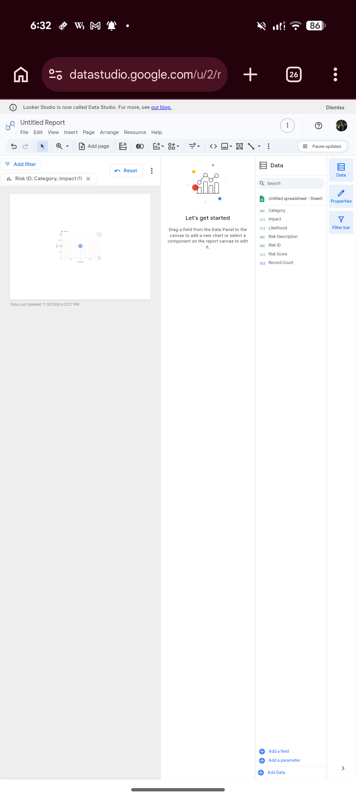

# portfolio-risk-dashboard
Interactive Portfolio Risk Dashboard built using Looker Studio for financial risk analysis.
# 📊 Portfolio Risk Analysis Dashboard

## Overview
This project is an interactive portfolio risk dashboard built using **Looker Studio** to visualize investment performance, portfolio risk, and asset allocation.

## Objectives
- Analyze portfolio risk and performance.
- Visualize asset allocation.
- Support financial decision-making through interactive dashboards.

## Tools Used
- Looker Studio
- Microsoft Excel / CSV
- Data Visualization

## Key Features
- Portfolio performance overview
- Risk analysis dashboard
- Interactive charts and graphs
- Asset allocation visualization

## Skills Demonstrated
- Financial Analysis
- Risk Analysis
- Dashboard Development
- Data Visualization
- Business Intelligence
## Dashboard Preview

## Author
**Sagar Sahu**
BBA (Hons.) FinTech | ACCA Candidate
